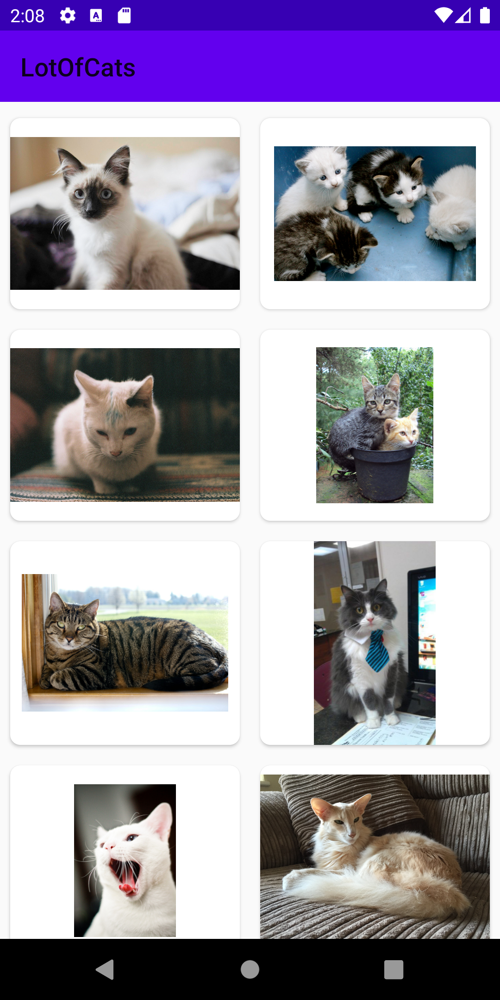
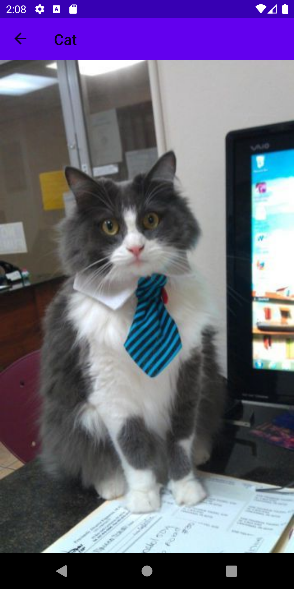

# LotOfCats

Android application wrote in Kotlin.

This is a personal project I'm developing to train my skills.

## Description

Displays a list of cats, click on the image to expand it.

## Build with

* [Kotlin](https://kotlinlang.org/) - Language
* [TheCatApi](https://docs.thecatapi.com/) - Api to retrieve cats
* [Glide](https://github.com/bumptech/glide) - Load image from url
* [KOIN](https://insert-koin.io/) - Dependency injection
* [Retrofit](https://square.github.io/retrofit/) - Http client

Built following the MVVM patern

## Screenshots

## Apk

Fichier apk de l'app [ici](https://github.com/valdeschamps/LotOfCats/tree/master/app/build/outputs/apk/release)